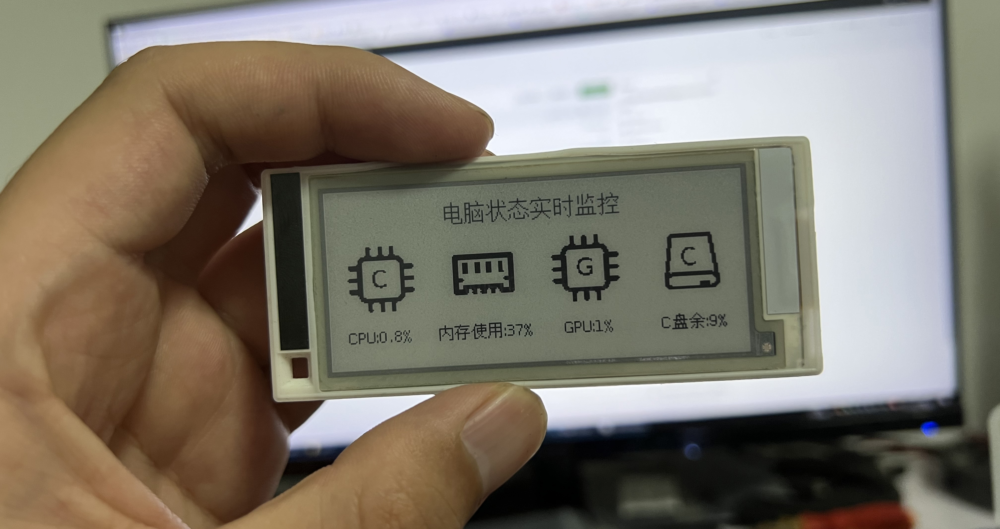

## 2.9寸墨水屏-电脑状态实时监控显示


### 项目简介
此项目使用ESP8266驱动2.9寸墨水屏，实时显示电脑各种状态，cpu使用率，内存使用率等  
- **B站视频演示地址：[点击观看视频](https://www.bilibili.com/video/BV1hh4y1d78L)**<br>
- <a target="_blank" href="https://qm.qq.com/cgi-bin/qm/qr?k=OCk2mwPC4yZn-BBJlH2ehWT-2sHfC7Os&jump_from=webapi&authKey=iFtohDmv6OI7O5aD/0ogd6mODvY5vr837fherj6ruuDCK94UM5KrjicZ2cFO5dHB"></a>QQ交流群：1051455459  

### 需要的环境
- Windows电脑，安装好Python环境  
- Arduino IDE  

### 使用的硬件
- ESP8266开发板+2.9寸墨水屏（闲鱼搜记得带马扎 可以购买整套）  
- 3.7v锂电池  

### 代码使用说明

- Python代码运行需要安装依赖库，如果已安装请忽略
``` python
pip install psutil
``` 
``` python
pip install pynvml
``` 
- 墨水屏上电后会开始连接wifi，wifi连接成功后，会提示电脑端运行Computer-Status.py，电脑端运行Computer-Status.py文件后，墨水屏就可以获取到电脑的运行状态并实时显示。从左到右依次为CPU使用率、内存使用率、GPU使用率、C盘剩余空间百分比  

- enjoy


